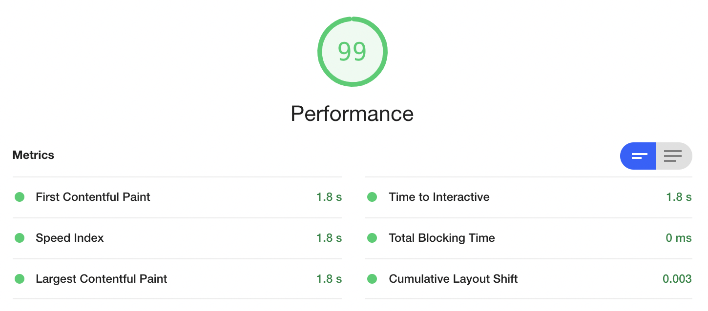

# Simon Key Game

[Live Website](https://hddahdda.github.io/Simon-Game/)

## About
This is a memory game, inspired by the classic "Simon Game". It might be viewed as a rebranding of the game, intended to be a more "calm" version of the earlier game. It is created using several different technologies. 

While researching the Simon Game I thought It to be interesting as it is both fairly easy while progressing towards complexity. I thought It would be interesting to create a modern Simon Game where the gameplay is the same whilst the design and sounds are new. 

# UX
## Strategy 
The goal of the website is to create a game that is fun to play whilst challenging  the players memory. It's gameplay is inspired by the original game, whilst the design and audio is intended to feel more modern and simplistic. My intention in the creation of the game is also for the code to be easily understood and manageable. Mainly so parents/adults that wan't to personalize the game to appeal to their child can do so. 

**User Stories**
* Children age 4+
* Adults wanting to test well-known game in a new way.
* People wanting to test their memory.
*  Parents that can use of a break and want their child to focus their attention on a device. 

**Reasons for the website**
* A game that is fun to play
* A game that is easily understood
*  A code that is easily changeable without causing errors. 

## Scope

**What the user may expect**
* Gameplay instructions to be easily understood. 
* Gameplay working 
* For the game to work across devices. 
* Audio working 

**What the user may want**
As this is a game created for children I decided to create two different lists, one for the child and another for the parent.

**Child**
* For their achievements in the game to be acknowledged by the game
* To be able to see current progress  
* For the website design to be fun to look at.
* For the language to be easily understood. 

**Parent**
* For the game not to be overstimulating for their child.
* For the game to be interesting enough to withhold the attention of the child. 
* For the sounds of the game not to be stressful. 
* For the code to be easily understood, structured and accurate with comments

**Addressing user needs and expectancies**
| What the user may want| How? | 
| :---        |    :----:   |          ---: |
| For their achievements in the game to be acknowledged by the game    | By having the current level displayed in the header.      |
To be able to see current progress  |  The current level is indicated in the h2 as soon as the game is started.    |
|  For the website design to be fun to look at.      |  By using colours that are tetradic, a header font that is fun to look at.       
| For the language to be easily understood.   |  The language is written so that a native english speaking child could understand it.     | 
## Structure
The website consists of one page which is the frontpage. The goal during the process of creating the game was to try to keep it simple and easily maintainable. This regarding both the code as well as how the website is viewed. 

**Wireframes**

### Design

**Audio**
The sounds were created using GarageBand, which is a built in musicprogram found across devices created by Apple.  Each sound matches a note ranging from C-F.  To avoid any issues regarding copyright, I created the sounds myself using GarageBand. 

**Colors**
By the use of a [Color wheel](https://www.canva.com/colors/color-wheel/) I chose  the color combination "tetradic", which are a set of four colours that are complementary. This in hope of gaining and maintaining the attention of the intended user, which, In this case, is a child. Tetradic colors can come across as a bit much when very light or "clear" in It's tone, I therefore decided to "choose more subdued tones of the color" as suggested in [this](https://mann-co.com/color-combinations-draw-attention/) article. 

()

**Fonts**

## Features 
**Existing Features**
* Start Game - When button "start game" is pressed, the game starts 

* Level indicator - h2 is updated to render which level the player is currently on. 

* Game Over + Restart - When game is over, the player can choose to restart the game.

**Features left to implement**
* Adding another level which makes the game play faster, this could be done by setting shorter time intervals in JavaScript. 

## Technologies Used
* HTML 5
* CSS3
* Bootstrap 5.0.0
* JavaScript
* jQuery
* Git
* GitPod
* GitHub
* GarageBand 
* [Ezgif](https://ezgif.com/video-to-gif) - to convert screen recordings to gifs

## Testing
### Code validation
* For HTML validation I used [W3C HTML Validator](https://validator.w3.org).

* For CSS validation I used [W3C CSS Validator](https://jigsaw.w3.org/css-validator/)

* For JavaScript validation I used the [JSHint](https://jshint.com/) which gave me the following warnings: 

However, after browsing Code Institues Slack community, this could be solved by pasting the following code in the head of the JavaScript file. 
* `/* jshint esversion: 6 */`  
`/* globals $:false */`

Which resulted in:

### Manual Testing 

#### First Testing

| Test Description| Expected Outcome | Result   |
| :---        |    :----:   |          ---: |
| Game start button      | When clicked the button should start the game       | Game starts  |
H1 turning green |    That the H1 turns green when the game is started.      | H1 turns green, however font weight appears too thin|
| Audio      |  For the audio to be working when buttons are pressed either by computer or manually.       | Audio is working, when several buttons are clicked in a short period of time the sound this creates a weird sound.  |
| Start button disappear   | After the start buttton is clicked, it should become hidden not to confuse or interfere with gameplay.        | Does not work      |
| Start button reappear       | Once the game is over the start button should reappear to make it possible to restart the game.       | Does not work   |
| Restart button   | For the restart button to restart the game.       | Does not work      |
| Level indication      | As the game is started it should be possible to see which level the user is on.       | Does work, the level is viewable in the header. |
| Game over   | For the text Game Over to appear when the game is over        | Does work, the text displays that the game is over as well as the final level.
| Font Awesome icons   |  For the Font Awesome icons to be rendered nicely in the different buttons.     | The icons work, however the game starts lagging, some buttons randomly are neither clickable or able to produce sound.

#### Final testing

| Test Description| How it was solved |New  Result   |
| :---        |    :----:   |          ---: |
|H1 too thin     | Increased font weight to 900      | H1 heavier  |
 |   Audio sounds bad      | --| Not fixed yet
|  Start button did not disappear     | By adding a class in css called .invisible which made the button transparent.   |Button is still there, but not able to be clicked or viewed. Therefore achieving the intended results.   |
| Start button did not reappear    | By removing class .invisible once the game is over      | Does work    |
|   Restart button not working    | As the game was started using jQuery click event this was a little bit more tricky. As resetting the values of the strings did not seem to "fix" this I decied to use a JavaScript function that refreshes the whole page, thereby clearing the cache and stored values in JavaScript.       | The Restart button works, but instead of restarting the game directly the user is taken back to the homepage. From which it is possible to restart the game.  |
 Font Awesome icons script/stylesheet interupt JS script.  | I both tried using Font Awesome Script and Font Awesome stylesheet, I also tried placing the script/ stylesheet in different places in the index, when that did not work I tried to move around my other script tags so these would be read earlier by the compueter. However nothing have worked so far, the bug remains with the script/stylesheet.     | Even though It affected the design I decided to remove Font Awesome completely because I felt that It risked to interfere with the gameplay. 

#### Button invisible:
CSS:
   

     .invisible {color: rgba(0,0,0,0);background-color: rgba(0,0,0,0);}

JavaScript:

    $(".btndiv").addClass("invisible");

#### Reseting the game
To reset the game I used location.reload(); which is a JavaScript function that resets the page, as you would if you were to refresh it.

    location.reload();

### Font Awesome Bug   

As seen above, the buttons doesn't work properly when using Font Awesome. Therefore I decied to completely skip this feature. 

### Testing Responsiveness 
I used [Am I Responsive](http://ami.responsivedesign.is/) to see that my website rendered as intended across devices. 

I also user Google Developer Tools to test responsiveness as well as keybreaks.

### Lighthouse 
The website was tested in in [Lighthouse](https://developers.google.com/web/tools/lighthouse) using Google Developer Tools. By doing this Lighthouse creates scores for performance, accessibility, best practices, and SEO. 

The website scored well in all categories. 

## Deployment
[This website](https://hddahdda.github.io/Simon-Game/) is hosted via GitHub pages and was created using GitPod which is a free code editor online. 

### How to create a new repository in GitHub
* If you don't have a GitHub account, create one on [github.com](https://github.com/) 
* Click on the button in the right corner, then click on "Your Repositories"

* Click on button that says "New"

* Give your repository a name 

* Create repository

You have now successfully created a GitHub repository!

### How to deploy a website: 
* Go to your GitHub Repository, click on "Settings".

* Scroll down to "GitHub Pages", click at "Check it out here!"

* Choose the "Master Branch", "Root", and Click "Save"

* Your website is now being created and will be aviliable in a moment. 

## How to clone this repository
* Click the "Code" button.

* At this stage you can choose between different alternatives, one is to download the files to your desktop, unzip them and then use in code editor by choice. 
* You could also copy this link: " https://github.com/hddahdda/Simon-Game.git " 
* Starting your code editor, then pasting git clone https://github.com/hddahdda/Simon-Game.git in to your terminal.
* You have now successfully cloned the files of the website!

### How to personalize the code: 
**To personalize this code to better fit specifik user needs you could do the following.**
* To do this you need to have access to de files, if you don't, make sure to clone them before starting.

**Changing colors** 
* Inside the folder assets/css, go to style.css.
* At the top of the file are the "root colors", to change them, simply change the color value of choice. This way you could easily change background color, font color as well as key colors.

**Changing messages displayed in H2** 
* Inside the folder assets/js, go to script.js.
* Scroll down to "checkGame" function. 

* To personalize the messages displayed you could change this part of the code: 
$("h2").text("Text of choosing here " + level); 
* As well as this part:
   $("h2").text("Text of choosing here" + level);

### How to use the git command line in GitPod
** To see which files and folders are added, commited, modified or pushed **
* Type: git status
** To add a file/folder to be commited **
* Type: git add folder/filename for example: git add assets/cs/style.css
* To add all type: git add --all
** To commit changes to Git ** 
* Type: git commit -m "added this and this" 
** To push files to GitHub **
* Type: git push 

Your files are now being pushed to GitHub. 

## Credits

* [This](https://www.youtube.com/watch?v=ahGDFFAgKII) great Simon Game tutorial 
* Friend Harald for excellent support
* Mentor Brian 
* Slack